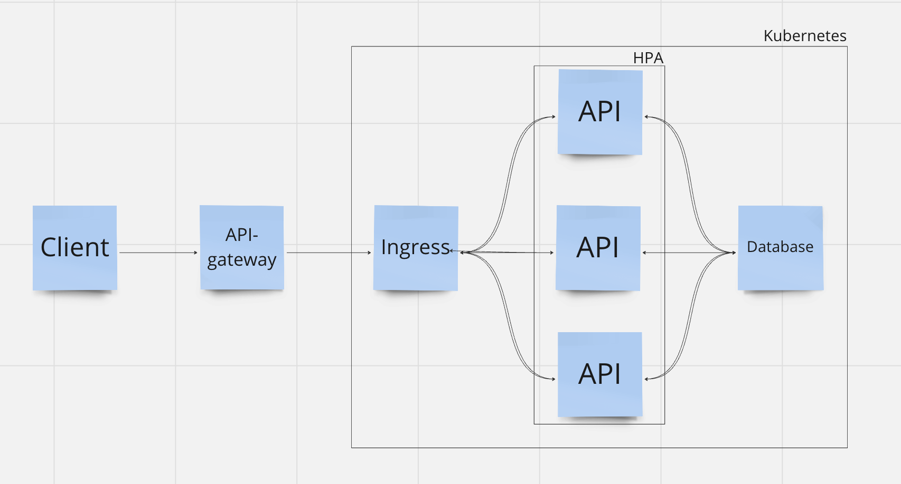
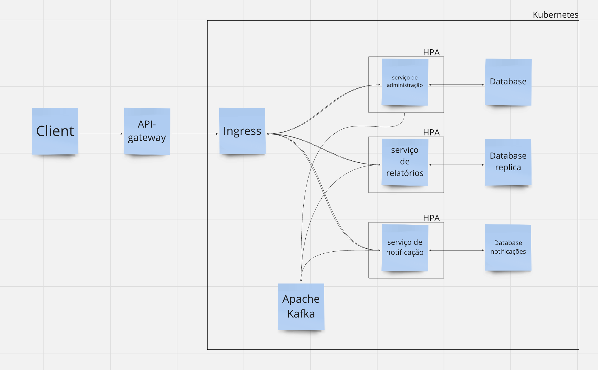

# Descrição do Trabalho

## Explicação da solução MVP

Para atingir os requisitos funcionais e não funcionais do MVP buscamos desenvolver um monolito do sistema de ponto contendo os endpoints pedidos separados pela arquitetura limpa e seus domínios. Com isso, nós atendemos os requisitos de:
- Autenticação de usuário;
- Registro de ponto;
- Visualização de registros;
- Relatórios;
- Segurança;
- Disponibilidade.

O sistema foi desenvolvido de um jeito que é possível escalar para a etapa 2, podendo evoluir para microservices se necessário. Para esse MVP o monolito, pela simplicidade da implementação, serviu perfeitamente para atingirmos esses requisitos. Para os requisitos não funcionais como desempenho, escalabilidade, disponibilidade, segurança, integridade dos dados e resiliência usamos o kubernetes para o gerenciamento da infra da aplicação. Com seus arquivos de deploy, podemos facilmente fazer o deploy em qualquer infra na nuvem que existe no mercado (no nosso caso, usamos a AWS), podemos garantir a disponibilidade da aplicação em horarios de picos com a sua configuração de HPA que vai de 2-10 pods escalando de acordo com o uso da CPU e memória dos pods.

## Explicação da solução evolutiva

Para a evolução do sistema, entendemos que podemos ir para a solução de microserviços. Criando os serguintes microserviços:
- Administração;
- Relatórios;
- Notificação.

Cada um desses microserviços farão parte da mesma infra, configurada pelo kubernetes, garantindo assim todos os seus benefícios. Além disso, o serviço de relatórios vai ser um serviço assíncrono e com um banco de dados réplica, isso serve para garantir a disponibilidade dos outros serviços durante o dia, pois um relatório tem um potencial para ser algo demorado e que impacte o banco de dados principal (caso ele use esse).
Cada serviço terá seu próprio banco de dados, onde usaremos um serviço de fila (como o Kafka) com o padrão SAGA do tipo coreografia na parte de comunicação que são mais críticas.

[Vídeo explicativo](https://drive.google.com/file/d/1hoPZZWOZ1Iaozb4jhY8NHqdRq2OxtQlA/view?usp=drive_link)

## Explicação da esteira de CI/CD

Configuramos uma simples esteira de CI/CD, onde foi dividido em 2 etapas:
- Build and Push: Build da imagem do docker e push para o ECR para a facilidade dos deploys. A pipeline é disparada a cada Pull Request que foi mergeado na master;
- Pull and Deploy: Pull da imagem do docker do ECR e deploy da aplicação pelo kubernetes.

Essa esteira de CI/CD, mesmo que simples no momento, garante que o serviço em produção esteja sempre na versão mais atual. Ela pode evoluir ainda mais, mas entendemos que para o MVP ela já atende os requisitos.
